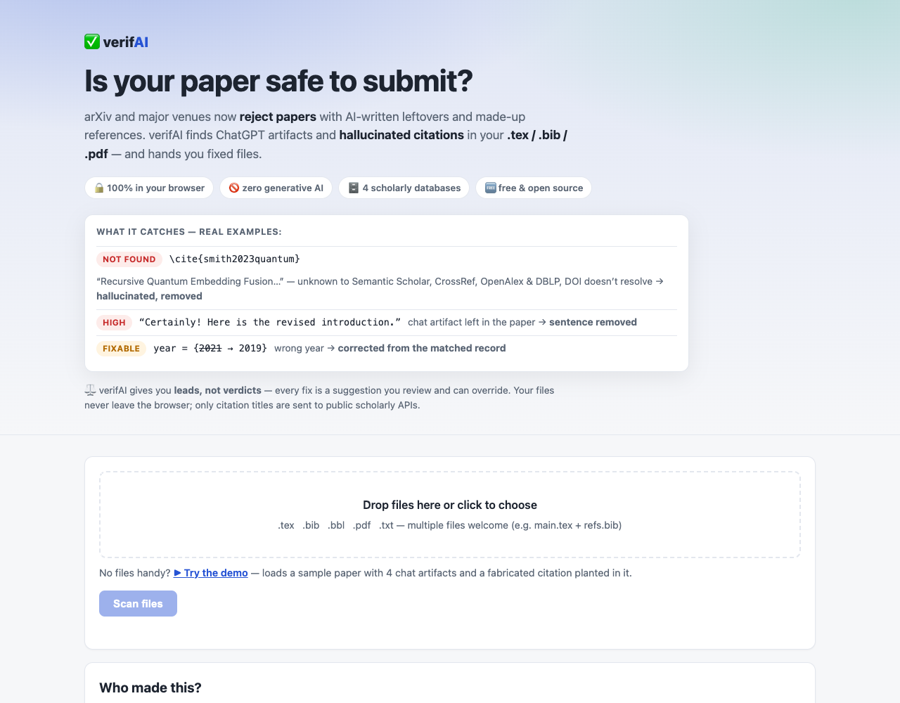

# 🧹 RemoveAI — catch AI-generated text & fake citations before arXiv does

[](https://github.com/Zangir/RemoveAIwebsite/actions/workflows/test.yml)
[](LICENSE)
[](https://zangir.github.io/RemoveAIwebsite/)
[](#how-it-works)
[](#contributing)

### ▶️ **[Open the checker — free, no signup](https://zangir.github.io/RemoveAIwebsite/)** · then hit *"Try the demo"*

arXiv (and a growing list of venues) now **rejects papers** containing obvious AI-generated
text — chat artifacts like *"Certainly! Here is your revised introduction"* — or
**AI-fabricated citations**. Reviewers screenshot these on social media. Careers get hurt
by a single leftover *"I hope this helps!"* in a PDF.

**RemoveAI checks your paper before anyone else sees it, and fixes what it finds.**



## What it catches

| | Examples | What happens |
|---|---|---|
| 🗣 **Chat artifacts** | "As an AI language model…", "I hope this helps!", "You're absolutely right", "Here is your revised…", leftover "Copy code" | sentence removed |
| 🕳 **Placeholders** | "[insert citation here]", "(Author, Year)", "[Your Name]", lorem ipsum | removed |
| 📋 **Paste artifacts** | markdown `**bold**` / ` ``` ` inside LaTeX, invisible Unicode, curly quotes | converted / removed |
| ❌ **Fabricated citations** | title unknown to **Semantic Scholar + CrossRef + OpenAlex**, DOI that doesn't resolve, real title with hallucinated authors | entry removed from `.bib` **and** its `\cite{…}` pruned from the `.tex` |
| 🔧 **Broken citations** | wrong year / DOI / venue / misspelled authors | corrected from the matched database record |
| ✍️ **Style tells** | em-dash density, "delve into", "ever-evolving landscape" | flagged for review only — never auto-removed |

Also reported: keys cited but missing from the `.bib`, entries never cited, duplicate keys.

## How it works

- **100% client-side.** Your files never leave the browser. Only citation titles/DOIs are sent
  to the three public scholarly APIs. Nothing is stored anywhere.
- **Zero generative AI.** Detection is 45+ deterministic key-phrase/regex rules; verification is
  database lookups with fuzzy title matching + author/year cross-checks. Every finding is
  reproducible and explainable.
- **Minimal diffs.** Fixes are spliced into your original source — no reformatting. Download
  fixed files individually or as a zip, plus a `report.md` problem table.
- Supports `.tex` (natbib *and* biblatex commands, embedded `thebibliography`), `.bib`
  (`@string`, concatenation, all the weird stuff), `.bbl`, `.txt`, and `.pdf`
  (text + reference extraction; report-only — recompile from fixed sources).

## Engineered to not cry wolf

False positives destroy trust, so the checker is deliberately paranoid about *itself*:

- A paper **about** LLMs quoting *"As an AI language model"* in `verbatim`/`lstlisting`/`\verb`
  is skipped; the same phrase inside quotation marks is downgraded to "needs review".
- *"you are **right-censored** data"* ≠ *"you are right"* — technical compounds are guarded.
- Books, theses, websites, software: absence from scholarly APIs proves nothing →
  marked *unverifiable*, **never** auto-removed.
- Off-by-one years are *optional* fixes (arXiv preprint vs. published version differ routinely).
- Same-title collisions (reprints, follow-ups) are disambiguated by author overlap + year.
- Phrases split across hard-wrapped LaTeX lines are still caught.
- Every action is a **pre-selected suggestion you can override** before files are generated.

Tested against real arXiv papers (clean papers come out clean — the *Attention Is All You Need*
and BERT sources produce zero high-severity findings) plus a planted-problem corpus:
**204 unit tests + Playwright end-to-end suites**, run in CI on every push.

## Honest limitations

Regex catches *artifacts* of AI generation, not AI-written prose in general — a carefully
edited AI text will pass, and absence of findings is not proof of human authorship.
Google Scholar has no API and arXiv's API blocks browser requests, so coverage comes from
Semantic Scholar + CrossRef + OpenAlex (which index arXiv). Scanned PDFs have no extractable
text. Every automated finding is a lead, not a verdict — you are responsible for your paper.

## Contributing

Found a false positive or something that slipped through?
[Open an issue](https://github.com/Zangir/RemoveAIwebsite/issues/new/choose) with the snippet —
each report becomes a regression test. New detection rules are one-line PRs in
[`js/core/detect.js`](js/core/detect.js).

```bash
node --test tests/*.test.mjs   # zero dependencies
```

If this saved your submission, ⭐ star the repo so others find it before their deadline.

MIT License.
